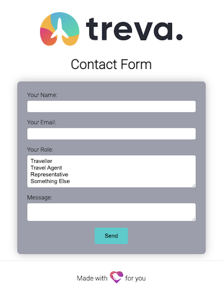

# Courier Netlify Form

This is a simple html form project that can be deployed to [Netlify](https://netlify.com). It uses [Netlify Forms](https://docs.netlify.com/forms/setup/) to handle the form submission. A [Netlify Trigger Function](https://docs.netlify.com/functions/trigger-on-events/) sends the verified submission via [Courier](https://courier.com) to the specified List or Recipient.

## Installation Options

First, sign up for a Courier Developer Account, it’s [free to sign up](https://app.courier.com/register/) and includes 10,000 notifications per month. Then, choose an option below.

### Option one: One-click deploy

Clicking this button will create a new repo for you that looks like this one, and sets that repo up immediately for deployment on Netlify. You will be prompted for a repo name and to provide the values for the following environment variables to used with Courier.

- Courier Auth Token (`COURIER_AUTH_TOKEN`), **required** - You can find this value in your [Courier API Keys Settings](https://app.courier.com/settings/api-keys)
- Courier Event (`COURIER_EVENT`), optional - This is the notification id or mapped event for the notification you would like Courier to send. This will default to `NETLIFY_FORM_{form name}`.
- Courier List (`COURIER_LIST`), **must provide a list or recipient** - This is the id of the list you would like Courier to send to. You can find your lists in the [Data > Lists](https://app.courier.com/data/lists) section of the Courier app.
- Courier Recipient (`COURIER_RECIPIENT`), **must provide a recipient or list** - This is the id of the recipient you would like Courier to send to. You can find your recipients in the [Data > Recipients]() section of the Courier app.

### Option two: Manual clone

You will need to [install the Netlify CLI](https://docs.netlify.com/cli/get-started/) and connect it to your Netlify site to run locally.

1. Clone this repo: `git clone https://github.com/aydrian/courier-netlify-form.git
2. Connect to Netlify using `ntl init`
3. Add the above environment variables using `ntl env:set [env var] [value]`
4. Run the app locally using `ntl dev`
5. Make any changes and push to your repo to deploy.
